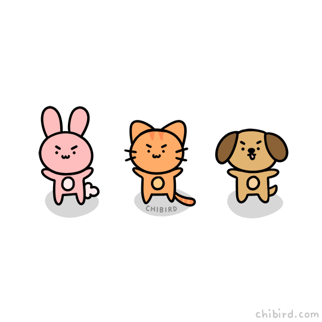

# mechanical-wombat


mechanical - “operated by a machine or machinery.”


 wombat - “a burrowing plant-eating Australian marsupial which resembles a small bear with short legs.”

> React UI component lib

[](https://www.npmjs.com/package/mechanical-wombat)
[](https://badgen.net/bundlephobia/minzip/mechanical-wombat)

## Install

```bash
yarn add mechanical-wombat
```

## Usage

```tsx
import { MyComponent } from 'mechanical-wombat';

export const Example: React.FC = ({ children }) => <Button {...props}>{children}</Button>;
```

## Default theme

```ts
const myTheme = {
  borderRadius: '5px',
  colors: {
    primary: 'green',
    secondary: 'blue',
  },
};
```
